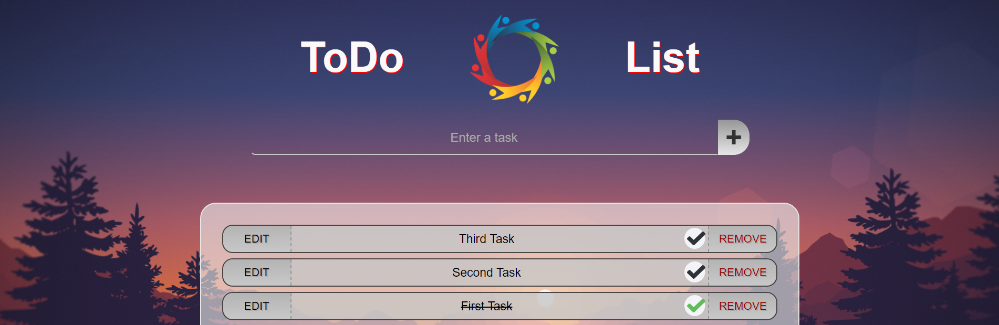

# react-project-to-do-list

Web project based on React / Redux, to create a basic to do list.

This is a version is connected to an API (not manage by me).
Here is a local version of this project: [To Do List Local](https://github.com/AGenson/react-project-to-do-list-local)

**This project is based on [react](https://github.com/facebook/react), using:**
- [redux](https://github.com/reactjs/redux)

# Description

First time using redux, here's a small react project consisting on creating a basic to do list.

This is only a static website developement, and is connected to a data storage via an API (which I have no control on).

Here's the website instance, thanks to [surge](http://surge.sh/) (free static web publishing): [http://react-project-to-do-list.surge.sh](http://react-project-to-do-list.surge.sh)

# Features

Features:
- Count of todos
- Filter (all / todos / completed)
- Edit a todo
- Complete a todo
- Remove a todo

Tools:
- [React](https://github.com/facebook/react) for the structure of the website
- [Redux](https://github.com/reactjs/redux) for local storage (count & todos)
